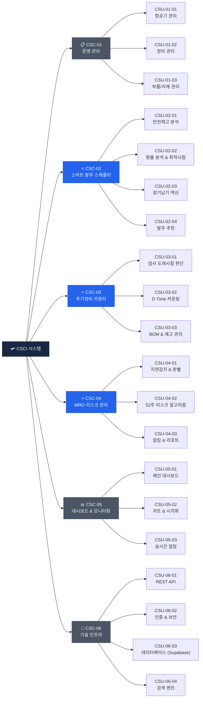

# Team: Potato_123
# 항공방산후속지원SW설계_프로젝트

# 비행교육원 가동률 극대화를 위한 항공 정비 자재 최적 구매 설정 시스템
---
## 프로젝트 소개
비행교육원의 가동률 극대화를 위한 항공 정비 자재 관리 및 최적 구매 설정 시스템입니다.
기종 2대의 비행시간 및 정비 주기를 관리하고 재고 부족 및 정비 임박 시 자동으로 알람보드를 통해 인지할 수 있도록 합니다.

---
 
 

## 👥 팀원 및 역할
| 이름 | 역할 | 담당 업무 |
|-----|-----|---------|
| 김재림 | DB | 하이라키 설계 및 구축, 시스템 데이터 연동, 데이터 정합성 관리 등 |
| 박세은 | 백엔드 | 정비 주기 자동 계산 로직, 알림 자동 생성 로직 등  |
| 박소진 | 프론트엔드 | UI/UX 설계 (와이어프레임 → 디자인), 백엔드/DB API 연동 등 |

---
 
 

## 🛠️ 기술 스택
| 구분 | 활용 언어 |
|------|------|
| Frontend |  |
| Backend |  |
| Database |  |
| 협업 도구 |   |

---
 
 

## 📱 주요 기능
| 기능 | 설명 |
|------|------|
| 메인 대시보드 | 재고현황 / 주기정비 및 비행시간 / 알림보드 |
| 재고 현황 | 전체 부품 재고 조회 및 상태 확인 |
| 부품 추가 및 삭제 | 신규 부품 추가 및 기존 부품 목록 삭제 |
| 재고 입출고 | 부품 입고 / 출고 처리 및 이력 관리 |
| 기체 관리 | 기종 2대 비행시간 및 정비 주기 확인 |
| 비행시간 입력 | 비행 후 시간 기록 및 정비주기 자동 계산 |
| 알림보드 | 재고 부족 / 정비 임박 자동 알림 생성 |

---
 
 

# CSCI 기능 구조도

## 전체 구조 테이블

| 컴포넌트 | 서브유닛 | 기능 설명 |
|---|---|---|
| **CSC-01** 운영 관리 | CSU-01-01 | 항공기 관리 |
| | CSU-01-02 | 정비 관리 |
| | CSU-01-03 | 부품/자재 관리 |
| **CSC-02** 스마트 발주 스케줄러 ⭐ | CSU-02-01 | 안전재고 분석 |
| | CSU-02-02 | 환율 분석 & 최적시점 |
| | CSU-02-03 | 장기납기 역산 |
| | CSU-02-04 | 발주 추천 |
| **CSC-03** 주기정비 카운터 ⭐ | CSU-03-01 | 검사 도래시점 판단 |
| | CSU-03-02 | D-Time 카운팅 |
| | CSU-03-03 | BOM & 재고 관리 |
| **CSC-04** MRO 리스크 관리 ⭐ | CSU-04-01 | 지연감지 & 판별 |
| | CSU-04-02 | 52주 리스크 알고리즘 |
| | CSU-04-03 | 알림 & 리포트 |
| **CSC-05** 대시보드 & 모니터링 | CSU-05-01 | 메인 대시보드 |
| | CSU-05-02 | 차트 & 시각화 |
| | CSU-05-03 | 실시간 알림 |
| **CSC-06** 기술 인프라 | CSU-06-01 | REST API |
| | CSU-06-02 | 인증 & 보안 |
| | CSU-06-03 | 데이터베이스 (Supabase) |
| | CSU-06-04 | 검색 엔진 |

---
 
 

## 계층 구조 다이어그램

---

## 모듈별 카드 요약

### 🔵 핵심 비즈니스 모듈 (⭐ 표시)

| | CSC-02 스마트 발주 스케줄러 | CSC-03 주기정비 카운터 | CSC-04 MRO 리스크 관리 |
|---|---|---|---|
| **핵심 기능** | 최적 발주 시점 자동 추천 | 정비 도래 시점 자동 계산 | 납기 지연 리스크 사전 감지 |
| **서브유닛 수** | 4개 | 3개 | 3개 |
| **주요 알고리즘** | 환율 분석, 납기 역산 | D-Time 카운팅 | 52주 리스크 알고리즘 |

### 🟢 운영 지원 모듈

| | CSC-01 운영 관리 | CSC-05 대시보드 | CSC-06 기술 인프라 |
|---|---|---|---|
| **핵심 기능** | 항공기·정비·부품 기초 관리 | 통합 현황 시각화 | API·DB·보안 기반 제공 |
| **서브유닛 수** | 3개 | 3개 | 4개 |
| **특이사항** | 마스터 데이터 관리 | 실시간 알림 포함 | Supabase + 검색엔진 |

...

...
